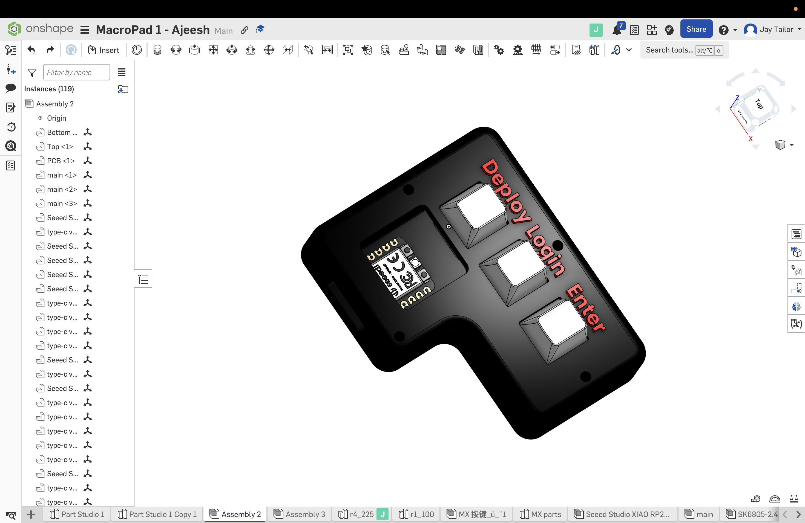
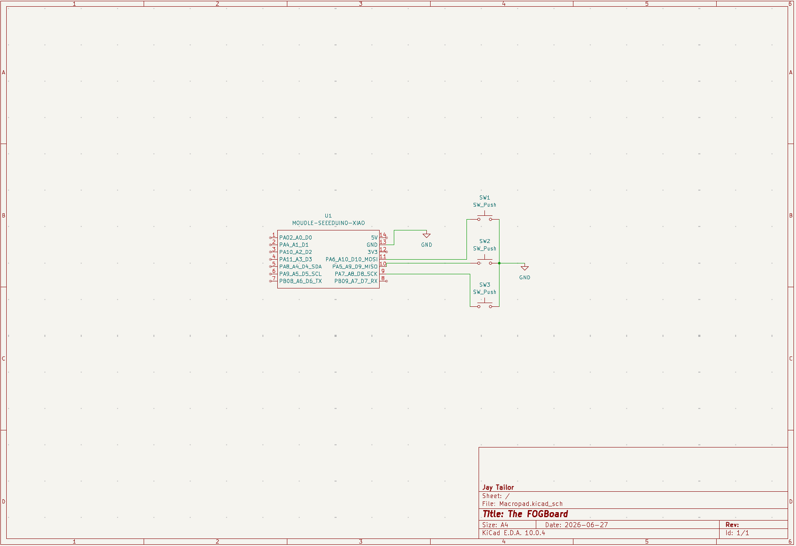
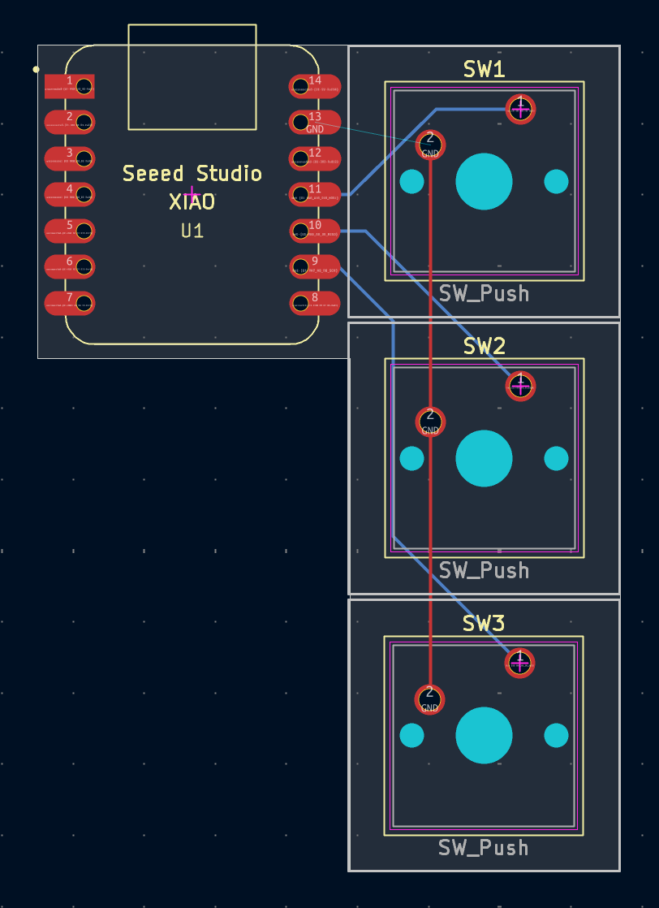

# The FOGBoard

FOGBoard is a 3-key Macropad that is based off of the SEEED XIAO RP2040. It's firmware is based off of the QMK Firmware & C Language.

It serves as a shortcut tool meant to be used for reimaging computers - Making it easier to perform tasks with the FOG Server.

## Features:

- Dual Layer 3D Printed PLA Outer Casing
- 3 Mechanical Keys
- Custom PCB

## CAD:

Everything fits together within 4 M3x16mm screws screwed to hold the top and bottom into one piece.

The two pieces (top.step & bottom.step) are meant to be sandwiched together through the screws.

The entire model was made on OnShape.

## PCB:

Here is my PCB! It was made on KiCad.  
The reason that I made this so basic is becuase this is my first time working on a project like this, I wanted to do something easy, but then as Hack Club introduces HackPad for the next time, I will be bringing this to the next level! 🚀

### Schematic

### PCB

## Firmware:

All of ther firmware was made through a combination of JSON & C.

- <b>The first key</b> is used to register an image in a FOG Server for a computer

- <b>The second key</b> is used to automatically log into a public account to the FOG Server

- <b>The third key</b> is used to select and enter the image for the computer that is being reprogrammed.

I will be adding more into the future! Stay tuned!

## Bill Of Materials (BOM)
These are all of the parts that you will need to make the FOGBoard!
- 3x Cherry MX Switches
- 3x DSA Keycaps
- 4x M3x16mm SHCS Bolts
- 1x XIAO RP2040
- 1x Case (2 Printed Parts) - Find the STEP File, top.step & bottom.step under /production
- 1x Custom PCB - Find gerbers.zip under /production

## Extra notes:

Not sure what to put here, but I wanted to thank Hack Club, specifically Alex Ren for organizing the HackPad! Excited to see what is going to be in the future!
