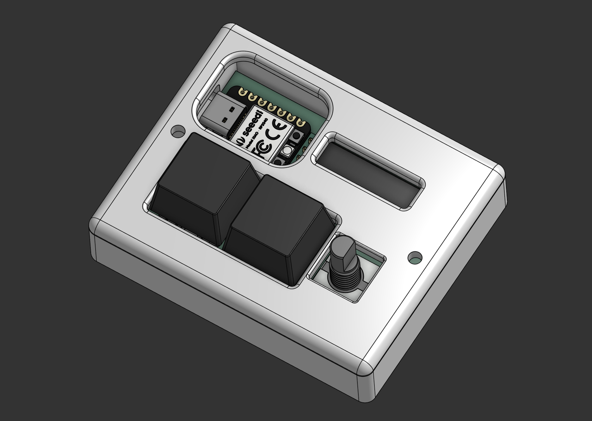
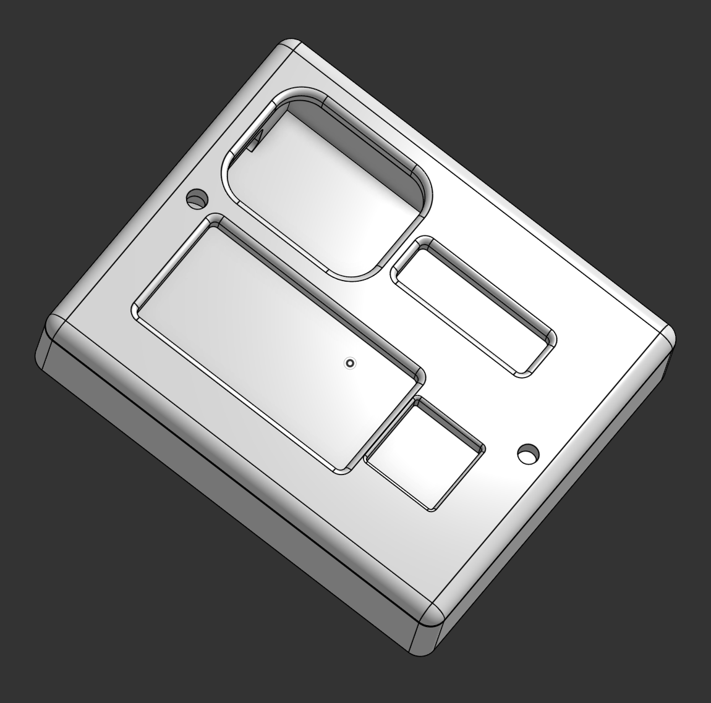
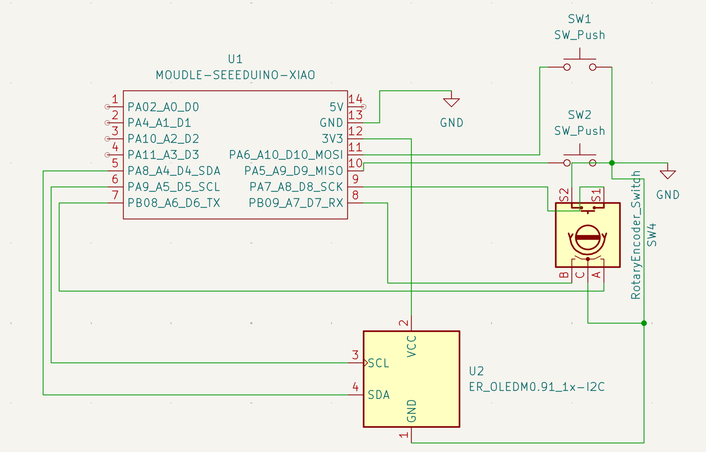
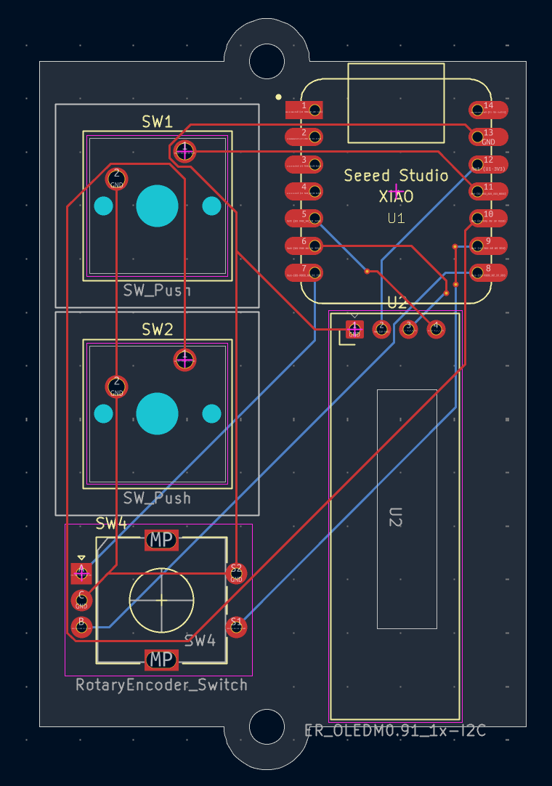

# The FOGBoard

FOGBoard is a 2-key, 1-encoder, and a Macropad with a screen that is based off of the SEEED XIAO RP2040. It's firmware is based off of the QMK Firmware & C Language.

It serves as a shortcut tool meant to be used for reimaging computers - Making it easier to perform tasks with the FOG Server.

## Features:

- Dual Layer 3D Printed PLA Outer Casing
- 2 Mechanical Keys
- 0.91" OLED Screen
- Rotary encoder for scrolling and entering
- Custom PCB

## CAD:

Everything fits together within 4 M3x16mm screws screwed to hold the top and bottom into one piece.

The two pieces (top.step & bottom.step) are meant to be sandwiched together through the screws.

The entire model was made on OnShape.

## PCB:

Here is my PCB! It was made on KiCad.  
I originally made the PCB to only support 3 keys, and the MCU. However, I redesigned it to support 2 keys, a rotary encoder, a 0.91" OLED, and the MCU for the project. I really like how everything turned out! :D 🚀

### Schematic

### PCB

## Firmware:

All of ther firmware was made through a combination of JSON & C.

- <b>The first key</b> is used to register an image in a FOG Server for a computer

- <b>The second key</b> is used to automatically log into a public account to the FOG Server

- <b>The third key</b> is when you press on the rotary encoder, which enters

- <b>The rotary encoder</b> is the up/down arrow. This makes it easy to scroll quickly through menus.

- <b>The OLED display</b> is a reactive Bongo cat! It reacts when you type, and it is overall pretty cool! Thanks to [nwii's bongo cat animation](https://github.com/nwii/oledbongocat/) that I open sourced for this part! :3

I will be adding more into the future! Stay tuned!

## Bill Of Materials (BOM)
These are all of the parts that you will need to make the FOGBoard!
- 2x Cherry MX Switches
- 2x DSA Keycaps
- 2x M3x16mm SHCS Bolts
- 1x XIAO RP2040
- 1x Case (2 Printed Parts) - Find the STEP File, top.step & bottom.step under /production
- 1x Custom PCB - Find gerbers.zip under /production

## Extra notes:

Not sure what to put here, but I wanted to thank Hack Club, specifically Alex Ren for organizing the HackPad! Excited to see what is going to be in the future!

Also, again, thanks to [nwii's bongo cat animation](https://github.com/nwii/oledbongocat/)!
